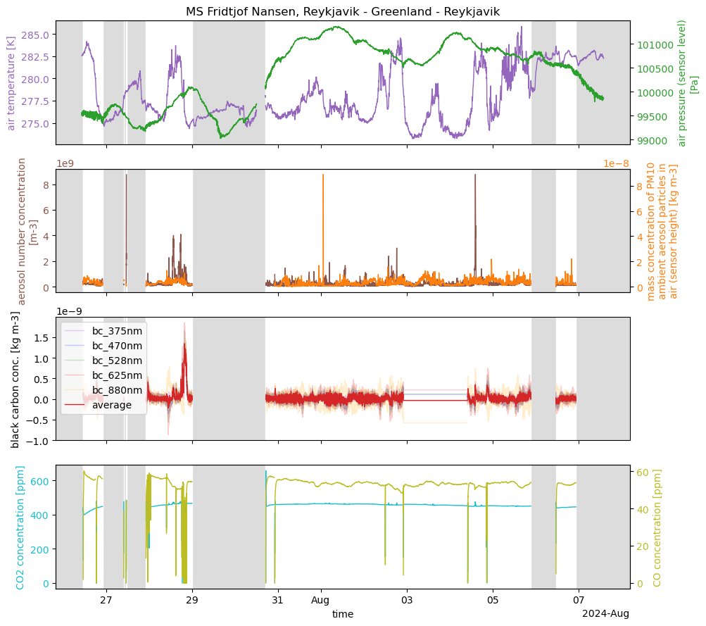

# PAMOS processing

PAMOS (Portable Atmospheric Measurement box On Sea) is an air monitoring device especially designed for commercial vessels within the project SOOP (Shaping an Ocean Of Possibilities for science-industry collaboration). The instrument runs fully autonomously without frequent onboard maintenance to use commercial vessels for collecting atmospheric data in remote regions. This will help to close the data gaps over the oceans. The PAMOS samples meteorological data (temperature, pressure, relative humidity, wind speed and direction, precipitation), position, aerosol parameters (particle number concentration, particulate matter, black carbon), and trace gases.

To process PAMOS raw data, we use the python package shipspy [[1]](https://github.com/shipspy-development/shipspy). It provides the commands 'pamos' and 'sections' which we use in the following. Here, we provide the settings used for shipspy. Furthermore, we provide additional scripts used for the final version of the data sets published on Pangaea [2].

## PAMOS deployments

### MS Fridtjof Nansen 24 July - 7 August, 2024 (Island/Greenland)
[](UPDATE)

The PAMOS with serial number 001 was deployed on the HX cruise vessel MS Fridtjof Nansen for one journey from Reykjavik to Greenland and back in the period 24 July - 7 August, 2024. The raw data was processed with shipspy [[1]](https://github.com/shipspy-development/shipspy):
```
shipspy pamos -i 2024_nansen_greenland -o 2024_nansen_greenland.nc -a shipspy_setting/pamos_variables.yaml -c shipspy_settings/laststring_header -f shipspy_settings/pamos_quality_flags_greenland.yaml -e shipspy_settings/pamos_additional_attrs.yaml
shipspy sections -i 2024_nansen_greenland.nc -o 20240724_20240807_msfridtjofnansen_pamos.nc -s shipspy_settings/nansen_2024_greenland_sections.txt -a shipspy_settings/pamos_nansen_2024_greenland_global_attrs.yaml
```
Afterwards, we added the positions from the ship GPS for reference and exported an additional csv file for Pangaea. The respective script for the final processing is [additional_scripts/pamos_greenland_final_cleanup.py](additional_scripts/pamos_greenland_final_cleanup.py).

### MS Fridtjof Nansen 30 November, 2024 - 26 March, 2025 (Antarctic Peninsula)
[](UPDATE)

The PAMOS with serial number 002 was deployed on the HX cruise vessel MS Fridtjof Nansen for the winter season 2024/2025 in the period 30 November - 26 March, 2025. During this time, the Nansen conducted eleven round trips from Ushuaia to the Antarctic Peninsula. Only data south of 60˚S is included. The raw data was processed with shipspy [[1]](https://github.com/shipspy-development/shipspy):
```
shipspy pamos -i 2024_nansen_antarctica -o 2024_nansen_antarctica.nc -a shipspy_setting/pamos_variables.yaml -c shipspy_settings/laststring_header -f shipspy_settings/pamos_quality_flags_antarctica.yaml -e shipspy_settings/pamos_additional_attrs.yaml
shipspy sections -i 2024_nansen_antarctica.nc -o 20241130_20250326_msfridtjofnansen_pamos.nc -s shipspy_settings/nansen_winter2425_antarctica_sections.txt -a shipspy_settings/pamos_nansen_winter2425_antarctica_antarctica_global_attrs.yaml
```
Afterwards, we added the positions from the ship GPS for reference and exported an additional csv file for Pangaea. The respective script for the final processing is [additional_scripts/pamos_antarctica_final_cleanup.py](additional_scripts/pamos_antarctica_final_cleanup.py).
## Minimal plotting examples

Plotting example for the whole campaign. Gray shaded areas indicate periods when the pump was not running.

```python
import xarray as xr
import numpy as np
import matplotlib.pyplot as plt

data = xr.open_dataset("20240724_20240807_msfridtjofnansen_pamos_shipposition.nc")

pump_switch = data["pump_flag"].dropna(dim="time").diff("time") != 0
switch_times = data.time[1:].where(pump_switch, drop=True).values

fig, axs = plt.subplots(4,1,figsize = (10,9), sharex = True)

ax1 = axs[0].twinx()
ax2 = axs[1].twinx()
ax3 = axs[3].twinx()

for ax in axs:
    if data["pump_flag"][0] == False:
        ax.set_facecolor("gainsboro")
        for i in np.arange(len(switch_times))[::2]:
            ax.axvspan(switch_times[i], switch_times[i+1], color = "white")
    else:
        for i in np.arange(len(switch_times))[::2]:
            ax.axvspan(switch_times[i], switch_times[i+1], color = "gainsboro")
        

plotting_dict = {"t_air": {"c": "tab:purple", "a": axs[0], "alpha" : 1},
                "p_air": {"c": "tab:green", "a": ax1, "alpha" : 1},
                "number_conc": {"c": "tab:brown", "a": axs[1], "alpha" : 1},
                "pm10": {"c": "tab:orange", "a": ax2, "alpha" : 1},
                "co2_conc": {"c": "tab:cyan", "a": axs[3], "alpha" : 1},
                "co_conc": {"c": "tab:olive", "a": ax3, "alpha" : 1},
                "bc_375nm": {"c": "darkviolet", "a": axs[2], "alpha" : 0.2},
                "bc_470nm": {"c": "blue", "a": axs[2], "alpha" : 0.2},
                "bc_528nm": {"c": "green", "a": axs[2], "alpha" : 0.2},
                "bc_625nm": {"c": "red", "a": axs[2], "alpha" : 0.2},
                "bc_880nm": {"c": "orange", "a": axs[2], "alpha" : 0.2}}

bc_mean = (data["bc_375nm"] + data["bc_470nm"] + data["bc_528nm"] + data["bc_625nm"] + data["bc_880nm"])/5

for v in plotting_dict.keys():
    col = plotting_dict[v]["c"]
    ax = plotting_dict[v]["a"]
    alpha = plotting_dict[v]["alpha"]
    data[v].plot(ax = ax, c = col, lw = 1, alpha = alpha, label = v)
    if not ax == axs[2]:
        ax.tick_params(axis = "y", labelcolor = col)
        ax.set_ylabel(ax.get_ylabel(), color=col)
    ax.set_xlabel("")

bc_mean.plot(ax = axs[2], c = "tab:red", lw = 1, label = "average")
axs[2].set_ylabel("black carbon conc. [kg m-3]")
axs[2].set_xlabel("")
axs[2].legend()

axs[3].set_xlabel("time")

axs[0].set_title("MS Fridtjof Nansen, Reykjavik - Greenland - Reykjavik")

plt.tight_layout()
```


## References

[1] Köhler, L. (2025). shipspy (Version 1.1.0) [Computer software]. https://github.com/shipspy-development/shipspy

[2] tba